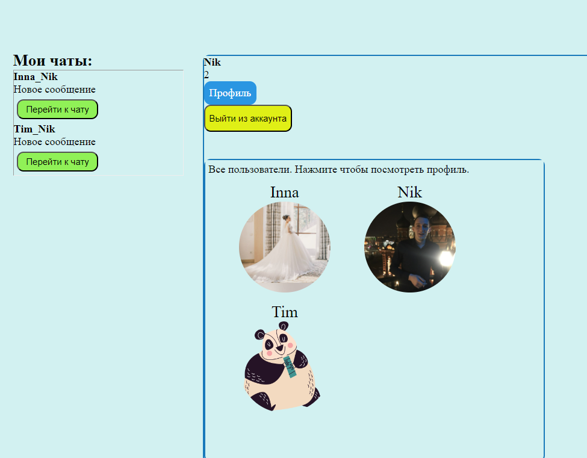
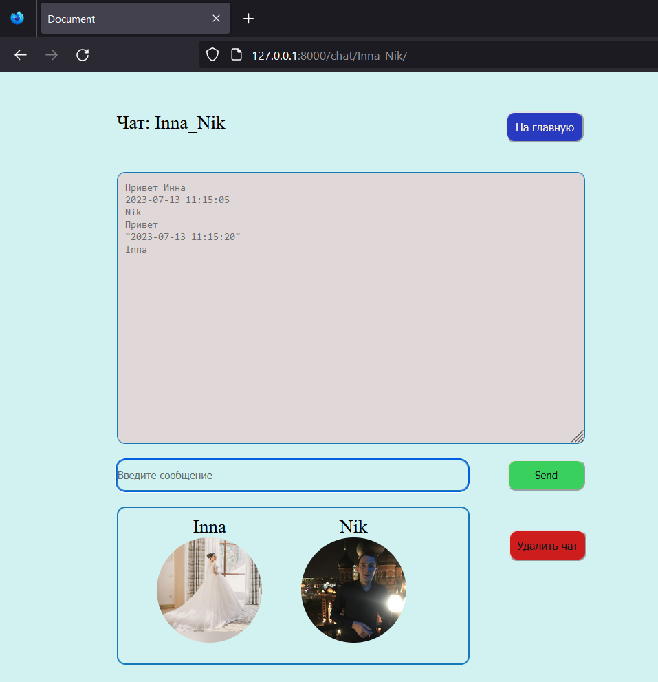

# Мессенджер на Джанго и JavaScript
## с применением Channels, DRF, NodeJS, HTML, CSS
____
### Установка приложения
____
Клонируем проект с репозитория 

```
git clone https://github.com/molodcovnik/SF_AJAX.git
pip install -r requirements.txt
venv\scripts\activate
(venv): cd src
```

Открываем еще один терминал для Redis.

```
redis-server
```

Если сервер не запускается, делаем следующее:

```
redis-cli
shutdown
exit
```

И запускаем заново

```
redis-server
```

В первом терминале запускаем проект:

```
python manage.py runserver
```

Переходи по ссылке:

http://127.0.0.1:8000/chat/

Готово!



Для доступа к полному функционалу чата необходимо зарегистрироваться!



